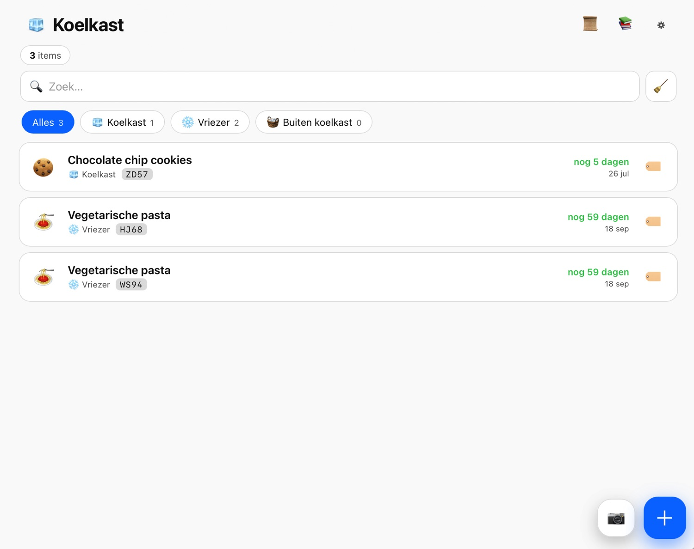
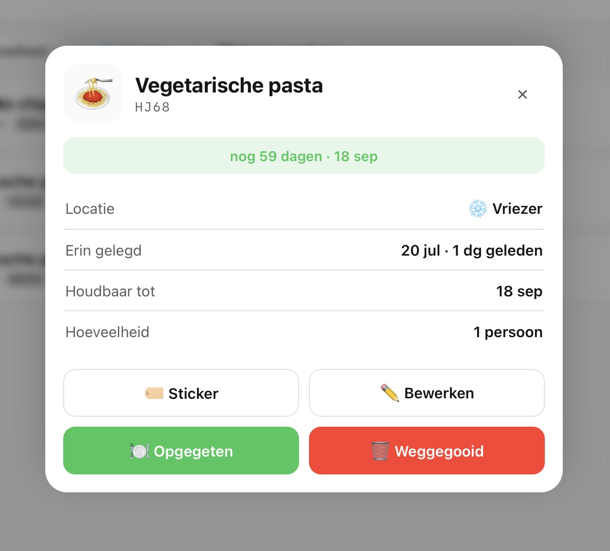
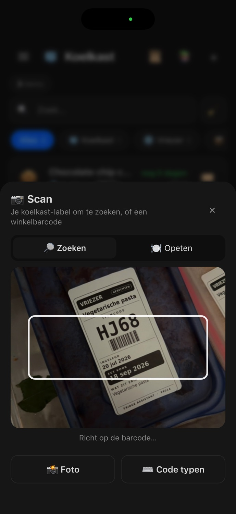
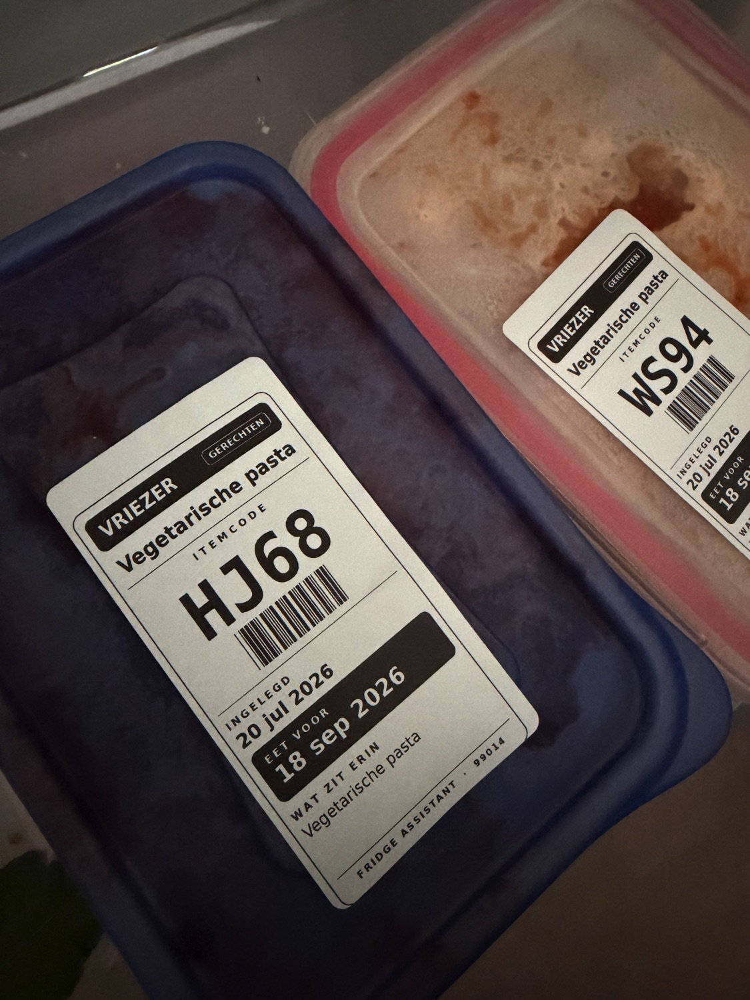

<p align="center">
  
</p>

<p align="center">
  <b>Know what's in your fridge, freezer and pantry — since when, and what to eat first.</b>
</p>

<p align="center">
  
  
  
</p>

---

**Fridge Assistant** is a Home Assistant custom integration that turns your fridge, freezer and pantry
into a searchable inventory. Every item gets a short code and a printable sticker, expiry dates are
estimated automatically from a 99-recipe database (or an LLM), and a mobile-first panel lets you add,
scan, and finish items right from your phone — standing in front of the open door.

It's built to be genuinely useful for a household with more than one person: every item remembers
*who* put it in, finishing an item (eaten / tossed) is logged with *who* and *when*, and there's a
full undo. It works completely offline; AI estimates and the printer add-on are both optional.

## Table of contents

- [Features](#features)
- [Screenshots](#screenshots)
- [How it works](#how-it-works)
  - [Inventory model](#inventory-model)
  - [Item codes & stickers](#item-codes--stickers)
  - [Automatic expiry estimation](#automatic-expiry-estimation)
  - [AI estimates](#ai-estimates)
  - [Barcode scanning](#barcode-scanning)
  - [Multi-user tracking & history](#multi-user-tracking--history)
  - [Notifications](#notifications)
  - [Mobile-first design](#mobile-first-design)
- [Installation](#installation)
- [Configuration](#configuration)
- [Services](#services)
- [Sensors](#sensors)
- [Optional: Label Printer add-on](#optional-label-printer-add-on)
- [Data & privacy](#data--privacy)
- [Known limitations](#known-limitations)
- [Architecture (for contributors)](#architecture-for-contributors)
- [License](#license)

## Features

- 📋 **Inventory** across fridge, freezer and pantry, with search and per-location filters.
- 🗓️ **Automatic expiry dates** from a built-in database of 99 common products & dishes (Dutch, i18n-ready),
  matched conservatively — it will ask rather than guess wrong.
- ✨ **AI estimates** for anything not in the database, via your existing Home Assistant conversation
  agent or a direct OpenAI key.
- 📚 **Templates manager** — view, edit, hide/restore built-ins, or add your own (with or without AI).
- 🏷️ **Unique item codes** (`AB12`-style) with an optional printed sticker (barcode included) via the
  companion label printer add-on.
- 📷 **Barcode scanning** — scan your own sticker to instantly find an item, or scan a retail barcode
  to add a new grocery product with its name/photo/quantity pre-filled.
- 👤 **Who added what** — items remember who put them in, shown with their Home Assistant person avatar.
- ✅ **Finish items** as *eaten* or *tossed*, logged in a paginated history with who/when — with undo.
- 🔔 **Expiry notifications** — a persistent notification + event fires daily (time configurable) for
  anything expired or expiring soon.
- 🧹 **Clean-up mode** — clear out everything past its date in one tap.
- 📱 **Mobile-first panel** — built for using with your phone in hand, standing at the open fridge door.
- 🌐 **Fully local** — works with zero internet access; AI estimates, barcode lookups and the printer
  add-on are all optional.

## Screenshots

<table>
<tr>
<td width="50%">

<p align="center"><sub>The inventory panel — filter by location, see what's expiring at a glance.</sub></p>
</td>
<td width="50%">

<p align="center"><sub>Item detail — print a sticker, edit, or finish it as eaten/tossed.</sub></p>
</td>
</tr>
<tr>
<td width="50%">

<p align="center"><sub>Scanning a Fridge Assistant label to instantly pull up that item.</sub></p>
</td>
<td width="50%">

<p align="center"><sub>Printed stickers (DYMO 99014) on containers in the freezer.</sub></p>
</td>
</tr>
</table>

## How it works

### Inventory model

Every item lives in one of three **locations** — koelkast (fridge), vriezer (freezer), or buiten
(pantry / outside the fridge) — and belongs to one of two **kinds**:

- 🥕 **ingredient** — a single product (milk, lettuce, cheese, ...)
- 🍲 **dish** — something prepared (leftovers, a home-cooked meal, ...)

Kind is derived from a set of 12 finer categories (vegetables, fruit, dairy, meat, fish, prepared
dishes, bakery, sauces & spices, drinks, eggs, leftovers, other) but can always be overridden per item.

### Item codes & stickers

Every item gets a unique 4-character code — two letters + two digits (e.g. `AB12`), with visually
ambiguous letters (I/O/Q) excluded so it always reads cleanly off a small sticker. The code format
(letters-first or digits-first) is configurable.

If the optional [Label Printer add-on](#optional-label-printer-add-on) is installed, a tap on 🏷️ prints
a sticker sized for a **DYMO 99014** label (54 × 101 mm) with the item name, a scannable Code 39 barcode
of the item code, the storage date, a bold "eat before" date, contents, and quantity/servings.

### Automatic expiry estimation

A seed database of 99 Dutch recipes/products (84 ingredients, 15 dishes) maps product names to
shelf-life in days, per location. Typing a name matches conservatively — an exact or near-exact
match is auto-suggested, but a loose one-word overlap is not (so "pizza" won't silently become
"cheese"), and negations like *"macaroni zonder vlees"* ("without meat") correctly exclude templates
that mention the excluded word. Every suggestion can be dismissed in favour of a manual date, a
different template, or an AI estimate.

The full database is editable from the **📚 Templates** manager: built-in templates can be tweaked
(creating a personal override, restorable with one tap) or hidden entirely; you can also add your
own from scratch, with or without AI.

### AI estimates

For anything the database doesn't know, Fridge Assistant can ask an LLM for a conservative,
food-safety-minded shelf-life estimate (days in fridge / freezer / pantry), a category, an emoji, and
a short storage tip — all editable before you save. Two ways to run it:

1. **Your existing Home Assistant conversation agent** (e.g. an OpenAI/Anthropic/Gemini/Ollama
   integration) — auto-selected, skipping the intent-only default Assist agent.
2. **A direct OpenAI API key** in the integration's options, calling the API directly
   (default model `gpt-4o-mini`).

You can save any AI estimate as a reusable template with one tap.

### Barcode scanning

Tap the 📷 button next to add (➕) to open the scanner. It has two modes:

- **🔎 Search** — scan one of your own printed stickers and its item opens immediately.
- **🍽️ Eat** — scan your own stickers to mark each one *eaten* on the spot, without leaving the
  camera view (handy right after cooking, to clear out what you used).

Scanning a barcode that *isn't* one of your own labels is treated as a **retail barcode** (EAN/UPC):
Fridge Assistant looks it up first against products you've scanned before (works offline, for repeat
purchases), then against [Open Food Facts](https://world.openfoodfacts.org/) (free, no API key) to
pre-fill the name, category, quantity and photo of a new item — you just confirm the location and date.

Three detection tiers keep it working across devices:

1. The native `BarcodeDetector` API (Android / Chromium) for live camera scanning.
2. A bundled [ZXing](https://github.com/zxing-js/library) decoder, lazy-loaded only on devices without
   a native detector (notably iOS) — live camera and photo-capture both work.
3. A photo-capture button and manual code entry as an always-available fallback.

> **Note:** live camera scanning requires a secure context (HTTPS) — it works over Nabu Casa or your
> own TLS, but falls back to photo/manual entry over plain `http://`.

### Multi-user tracking & history

Every item remembers who added it (resolved from the Home Assistant user behind the action) and shows
their avatar — pulled from a linked `person` entity's photo, or coloured initials if there isn't one.

Finishing an item — 🍽️ **Eaten** or 🗑️ **Tossed** — moves it into a **paginated history** log (who,
what, when), reachable via 📜 in the top bar. Every finish action can be **undone**, restoring the item
with its original id and code so a physical sticker still matches. History is capped at the most recent
500 events (a rolling window) so storage stays bounded — but your *active* inventory is never purged
automatically; an item only leaves the fridge when you finish it yourself.

### Notifications

A daily check (time configurable, default 09:00) fires an event and a persistent notification listing
anything expired or expiring within your configured warning window (default 3 days) — split into
"past date" and "expiring soon". You can also trigger the check on demand.

### Mobile-first design

The panel is built to be used one-handed with your phone in hand, standing at the open fridge:

- A native Home Assistant hamburger menu is injected into the panel header (a full-page custom panel
  otherwise has no sidebar access on mobile).
- Safe-area insets (`env(safe-area-inset-*)`) keep controls clear of the notch and home indicator.
- 44px+ tap targets and 16px inputs (avoids iOS auto-zoom on focus).
- A thumb-reachable floating add (➕) and scan (📷) button, bottom-right.

## Installation

### Via HACS (custom repository)

Fridge Assistant isn't in the default HACS store, so add it as a custom repository:

1. HACS → **Integrations** → ⋮ → **Custom repositories**.
2. Add `https://github.com/MaxGramser/fridge_assistant`, category **Integration**.
3. Install **Fridge Assistant**, then restart Home Assistant.
4. **Settings → Devices & Services → Add Integration → Fridge Assistant**.
5. Open **Koelkast** in the sidebar.

### Manual

Copy `custom_components/fridge_assistant` into your Home Assistant `config/custom_components/`
directory, restart Home Assistant, and follow steps 4–5 above.

## Configuration

All options live under **Settings → Devices & Services → Fridge Assistant → Configure**:

| Option | Default | Description |
|---|---|---|
| Warn this many days before expiry | `3` | How many days ahead "expiring soon" starts. |
| Enable AI estimates | on | Turn AI shelf-life estimation on/off. |
| AI conversation agent | *(auto)* | Which `conversation.*` agent to use. Leave empty to auto-pick an LLM agent. |
| OpenAI API key | *(none)* | If set, estimates call OpenAI directly instead of a conversation agent. |
| OpenAI model | `gpt-4o-mini` | Model used for direct API calls. |
| Item code format | letters-first (`AB12`) | Or digits-first (`12AB`). |
| Enable notifications | on | Toggle the daily expiry notification. |
| Daily check time | `09:00` | When the daily expiry check runs. |
| Enable label printer | off | Turn on once the [add-on](#optional-label-printer-add-on) is installed. |
| Label Printer add-on URL | `http://local-label-printer:8000` | Only change if you renamed/moved the add-on. |
| Copies per print | `1` | How many stickers to print per tap. |

## Services

All services live under the `fridge_assistant` domain and can be called from automations, scripts, or
Developer Tools → Actions.

| Service | Description | Key fields |
|---|---|---|
| `fridge_assistant.add_item` | Add an item. Expiry is estimated automatically from contents + location if not given. | `name`, `contents`, `location`, `added_date`, `expiry_date`, `quantity` |
| `fridge_assistant.update_item` | Update fields on an existing item. | `id`, *(any item field)* |
| `fridge_assistant.remove_item` | Delete an item outright (no history entry). | `id` |
| `fridge_assistant.complete_item` | Finish an item as eaten or tossed — logged to history with who/when. | `id`, `action` (`eaten` / `tossed`) |
| `fridge_assistant.remove_expired` | Clear out everything past its date in one call. | — |
| `fridge_assistant.estimate` | Ask AI to estimate shelf life for a product name. | `name` |
| `fridge_assistant.add_template` | Add or update a template in the shelf-life database. | `name`, *(template fields)* |
| `fridge_assistant.print_sticker` | Render and print a label via the add-on. | `id` |
| `fridge_assistant.run_check` | Run the expiry check immediately (event + notification). | — |

## Sensors

Three sensors are created per config entry:

- **Total items** — count of everything currently in the inventory.
- **Expiring soon** — count of items within the warning window (not yet past date).
- **Expired** — count of items already past their date.

Both expiry sensors expose the matching item list (code, name, days left, ...) as attributes.

## Optional: Label Printer add-on

The integration works completely without a printer — stickers are cosmetic. If you want physical
labels, install the companion **Label Printer** add-on from
[`addon/label_printer`](addon/label_printer):

- Generic by design: it accepts any PNG/PDF over HTTP and prints it via CUPS — the integration does
  all the rendering, so the add-on itself has no Fridge Assistant-specific logic.
- Drives **DYMO LabelWriter** printers over USB (`printer_model: auto` detects LW400/450/550 and
  picks the matching driver).
- Tested hardware: **DYMO LabelWriter 550** and **LabelWriter 400/450**, with **99014** labels
  (54 × 101 mm).

See [`addon/label_printer/DOCS.md`](addon/label_printer/DOCS.md) for installation, options, and the
HTTP API.

## Data & privacy

- All inventory data, templates, and history are stored **locally** in Home Assistant's own storage —
  nothing leaves your network for normal use.
- **AI estimates** send only the product name to your chosen conversation agent or directly to OpenAI
  (if you've configured an API key) — whichever provider you already use for that agent.
- **Retail barcode scanning** sends the scanned barcode number to the free
  [Open Food Facts](https://world.openfoodfacts.org/) API (server-side, from Home Assistant Core, not
  your browser) to resolve a product name/photo. This only happens when you scan a barcode that isn't
  one of your own labels. Nothing else about your inventory is sent.
- The printer add-on communicates only on your local network.

## Known limitations

- **The panel UI is currently Dutch-only.** It does not yet follow Home Assistant's configured
  language — every label in the custom panel is hardcoded Dutch, regardless of your HA locale. (The
  integration's own setup/options screens *do* follow HA's language normally, and AI notes / printed
  label text follow `hass.config.language` with an English translation available — but the main panel
  itself is not yet localized.)
- Live camera barcode scanning requires a secure context (HTTPS); it degrades gracefully to
  photo-capture or manual entry otherwise.
- The label printer add-on has only been tested against DYMO LabelWriter 400/450/550 with 99014 labels.

## Architecture (for contributors)

```
custom_components/fridge_assistant/
├── __init__.py          # setup, static paths, panel registration, daily check scheduling
├── config_flow.py        # config + options flow
├── const.py               # locations, categories, kinds, option keys & defaults
├── store.py                # persisted data layer: items, templates, history, matching logic
├── coordinator.py          # runtime object: options, notifications, expiry checks
├── services.py              # fridge_assistant.* services
├── websocket_api.py          # WebSocket API backing the panel (live state, mutations)
├── ai.py                       # AI shelf-life estimation (conversation agent / OpenAI)
├── products.py                  # retail barcode lookup (Open Food Facts)
├── codes.py                       # item code generation
├── label_render.py                  # Pillow-based DYMO label rendering (no HA imports)
├── brand_render.py                    # generates the icon/logo artwork in brands/
├── printer.py                          # renders + posts labels to the add-on
├── panel/
│   ├── fridge-assistant-panel.js         # the mobile-first custom panel (vanilla, no build step)
│   └── vendor/zxing.min.js                 # bundled barcode decoder for iOS/Safari
└── data/
    ├── seed_templates.json                   # the 99-template shelf-life database
    └── fonts/                                  # bundled fonts for label rendering

addon/label_printer/        # the optional, generic CUPS-based print add-on
brands/                       # icon/logo assets (Home Assistant brands format)
```

Backend changes require a full Home Assistant restart (`ha core restart`) — a config entry reload does
not re-import Python modules. Frontend (`panel.js`) and label design changes only need a browser/app
hard-refresh.

## License

MIT
